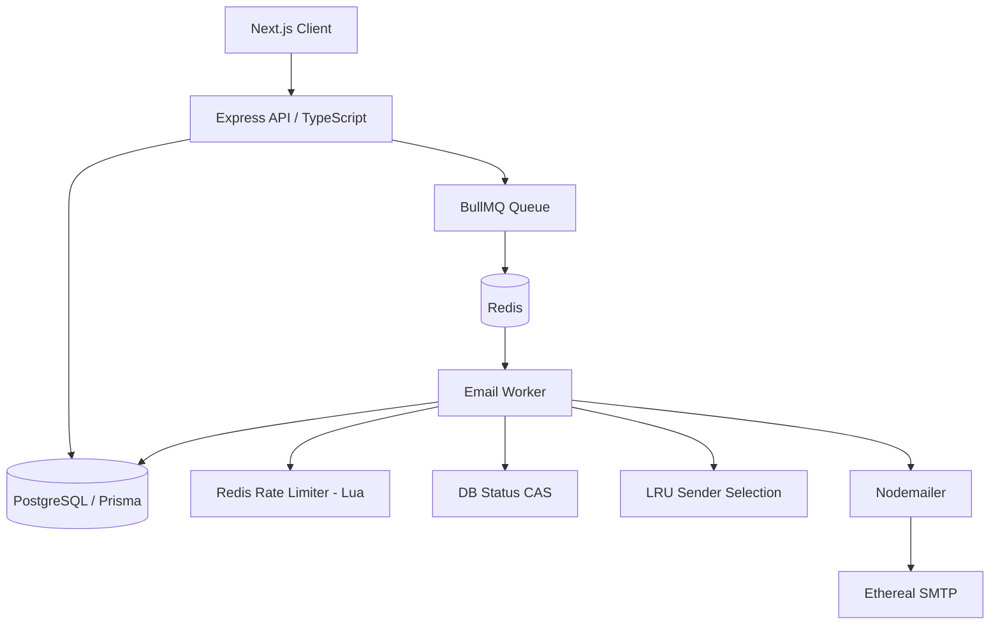

# ReachInbox — Email Scheduling Platform

Full-stack email scheduling platform: schedule bulk campaigns, enforce per-campaign
hourly rate limits, distribute across multiple SMTP senders, and survive process
restarts without losing or duplicating emails.

## Architecture

Three processes: the Next.js frontend, the Express API, and a **separate worker
process**. The worker is deliberately not in the API process — it can be scaled
or restarted independently, and restart recovery is only meaningful if the queue
consumer can die without taking the API with it.

## Tech Stack

| Layer | Choice | Why |
|---|---|---|
| API | Express + TypeScript (strict) | Required; explicit middleware control |
| DB | PostgreSQL + Prisma | Relational integrity, typed client, migrations |
| Queue | BullMQ + Redis | Delayed jobs without cron or polling |
| Auth | NextAuth (Auth.js) v4, JWT strategy | Native to Next.js; JWT verifies cross-origin without a shared session table |
| Mail | Nodemailer + Ethereal | Assignment-specified; preview URLs make sends verifiable |
| Frontend | Next.js App Router + Tailwind | Required |

## Email Lifecycle

    POST /api/campaigns
      -> Zod validation
      -> DB transaction: Campaign + N ScheduledEmail rows
      -> commit
      -> enqueue N BullMQ jobs, delay = startAt + (i * minDelayMs)
      -> Redis persists delayed jobs
      -> [scheduled time]
      -> Worker receives job
      -> campaign still ACTIVE?
      -> atomic CAS: SCHEDULED/RESCHEDULED -> PROCESSING
      -> rate limit check (Redis Lua)
      -> LRU sender selection
      -> SMTP send
      -> DB: status=SENT + previewUrl

## Minimum Delay Between Emails

Delay is applied **at scheduling time**, not at send time: email *i* is enqueued
with `delay = startAt + (i * minDelayMs)`. This makes spacing a property of the
schedule rather than something worker concurrency has to coordinate, so
`concurrency=5` and `delay=2000ms` do not conflict — five workers can run in
parallel and still produce correctly spaced sends, because the jobs simply do not
become available at the same time.

## Rate Limiting

Redis key: `rate:{campaignId}:{hourEpoch}`, TTL 3600s.

Atomicity comes from a Lua script that INCRs, sets EXPIRE only on first
increment, and DECRs if the increment exceeded the limit — one round trip, no
INCR/EXPIRE race, correct across any number of worker processes.

**Over-limit emails are never dropped.** The worker writes `RESCHEDULED`,
computes the next hour boundary, and re-enqueues with a distinct job ID.

Two details that are easy to get wrong and are handled explicitly:

1. **The re-enqueued job needs a NEW jobId.** The current job is still `active`
   and completed IDs are retained for 24h by `removeOnComplete`, so reusing the
   ID makes BullMQ silently ignore the add and the email is lost forever.
   Reschedules use `{id}:r{n}`. Duplicate-send safety does not depend on the
   jobId — see Idempotency.
2. **Deferred jobs are staggered** by `n * minDelayMs` past the hour boundary.
   Without this, every deferred job in a batch wakes on the same millisecond,
   one hour's worth win the race, and the rest immediately re-defer.

## Concurrency

`WORKER_CONCURRENCY` (default 5), configurable via env, never hardcoded.

Safe under concurrency because every shared decision is atomic: the rate limiter
is a single Lua script, the status claim is a conditional UPDATE, and sender
selection happens inside a transaction. No worker holds state another worker
depends on.

## Idempotency

Four independent layers:

1. `@@unique([campaignId, recipientEmail])` — the same recipient cannot be
   scheduled twice for one campaign, enforced by Postgres.
2. `jobId = scheduledEmailId` — BullMQ silently ignores a duplicate enqueue.
3. **Atomic CAS claim** — `UPDATE ... SET status='PROCESSING' WHERE id=? AND
   status IN ('SCHEDULED','RESCHEDULED')`. If two workers race, the second sees
   0 rows affected and returns without sending. This is the load-bearing guard.
4. Terminal states (`SENT`/`FAILED`) fall outside the CAS predicate, so a
   redelivered job can never re-send an already-sent email.

**The honest gap:** if SMTP accepts a message and the process dies before the DB
write, the retry finds status=`PROCESSING`, fails the CAS, and skips — so that
email is recorded as PROCESSING but was actually delivered. This is the classic
dual-write problem and is unsolvable without either distributed transactions or
a provider-side idempotency key. The chosen trade-off is **at-most-once
visibility with a possible silent success** rather than at-least-once with
possible duplicates: for cold email, sending twice is worse than an unclear
status. A production system would reconcile against the provider's message log.

## Restart Recovery

Delayed jobs live in Redis with AOF persistence, so they survive a worker restart
on their own — BullMQ reconnects and processes them at their scheduled time.

The gap that Redis persistence does *not* cover is the dual-write window: the DB
commit succeeds, then the enqueue fails. `src/worker/reconcile.ts` runs at worker
startup, finds rows still `SCHEDULED`/`RESCHEDULED` under an `ACTIVE` campaign,
checks whether a BullMQ job actually exists, and re-enqueues the orphans. This is
the "controlled queue insertion + reconciliation" strategy — cheaper than a full
transactional outbox and sufficient here, because the DB is the source of truth
and re-enqueueing is idempotent.

## Multiple Senders

`SenderAccount` rows hold SMTP credentials, selected **least-recently-used**
inside a transaction that updates `lastUsedAt` — spreading load rather than
hammering one account.

**Security note:** `smtpPass` is stored plaintext. This is acceptable only
because these are disposable Ethereal test accounts. Production would use a
secret manager (AWS Secrets Manager / GCP Secret Manager) with the DB holding
only a reference.

## No Cron

Scheduling is entirely BullMQ delayed jobs. No `node-cron`, no `agenda`, no
`setInterval` polling loop. Verify with:

    Get-ChildItem -Recurse -Include *.ts | Select-String "node-cron|agenda|setInterval"

## Setup

    docker compose up -d
    cd backend; npm install; npx prisma migrate dev; npm run seed:senders
    npm run dev          # API      :3001
    npm run dev:worker   # worker
    cd ../frontend; npm install; npm run dev   # :3000

Google OAuth: create credentials at console.cloud.google.com, redirect URI
`http://localhost:3000/api/auth/callback/google`.

## Requirements Audit

| Requirement | Status |
|---|---|
| TypeScript backend (strict) | IMPLEMENTED |
| Express, PostgreSQL, Prisma, Redis, BullMQ | IMPLEMENTED |
| Delayed jobs, no cron | IMPLEMENTED |
| Configurable worker concurrency | IMPLEMENTED |
| Configurable minimum delay | IMPLEMENTED |
| Hourly rate limit, Redis-backed atomic | IMPLEMENTED |
| Rate-limited jobs rescheduled, not dropped | IMPLEMENTED |
| Multiple senders (LRU) | IMPLEMENTED |
| Ethereal SMTP + preview URLs | IMPLEMENTED |
| Idempotency (4 layers) | IMPLEMENTED |
| Restart recovery + reconciliation | IMPLEMENTED |
| Google OAuth, dashboard, name/email/avatar/logout | IMPLEMENTED |
| Docker Compose (Postgres + Redis) | IMPLEMENTED |
| .env.example, .gitignore | IMPLEMENTED |
| Scheduled/Sent API endpoints (paginated, ownership-scoped) | IMPLEMENTED |
| Scheduled/Sent UI tables | NOT IMPLEMENTED |
| Compose UI (CSV upload, extraction, config) | NOT IMPLEMENTED — API endpoints exist and are tested |
| Figma visual match | NOT IMPLEMENTED — functional UI only |
| Automated test suite | PARTIAL — unit tests for rate limiter and email validation |
| Deployment | NOT IMPLEMENTED — runs locally via Docker Compose |

## Known Trade-offs

- **Fixed-window rate limiting** permits up to 2x the limit across a window
  boundary. A sliding window would be stricter; fixed window was chosen for
  atomicity in a single Lua call.
- **Rate limit is per-campaign**, matching where the user configures it in the
  UI. Production would additionally enforce a per-sender-account limit, since
  SMTP reputation is a property of the sending address.
- **Frontend is incomplete.** Auth and dashboard shell work; the campaign
  composer and result tables were not finished within the time available. The
  backend endpoints behind them exist, are ownership-scoped, and have been
  verified end to end — see the smoke test below.
- **`nodemailer.createTestAccount()` deduplicates** rapid successive calls, so
  seeding may produce fewer than three distinct Ethereal accounts.

## Verification

`src/scripts/smoke.ts` schedules 5 emails with `maxPerHour=3`, which exercises
both the send path and the rate-limit path in one run. Observed result: 3 emails
delivered to Ethereal with preview URLs, 2 correctly moved to `RESCHEDULED` for
the next hour window.
